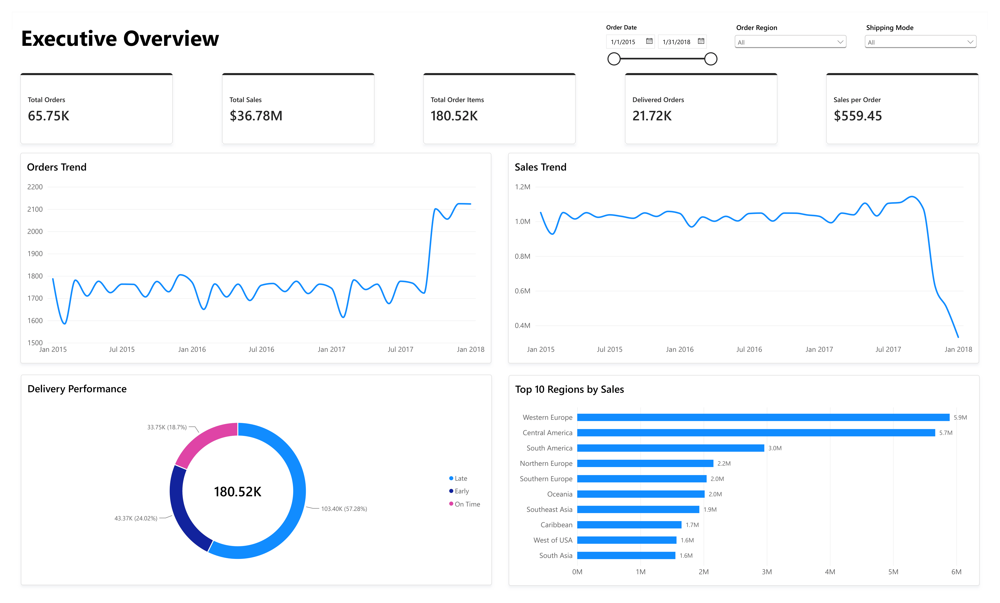
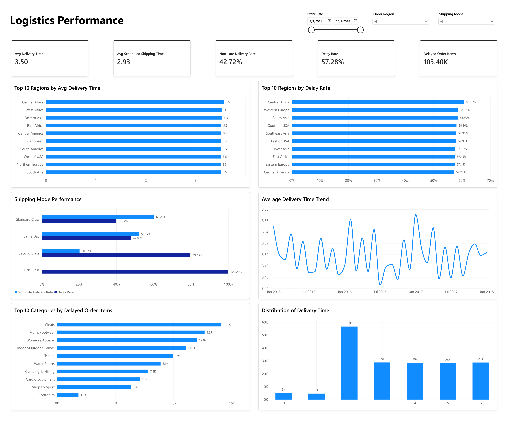
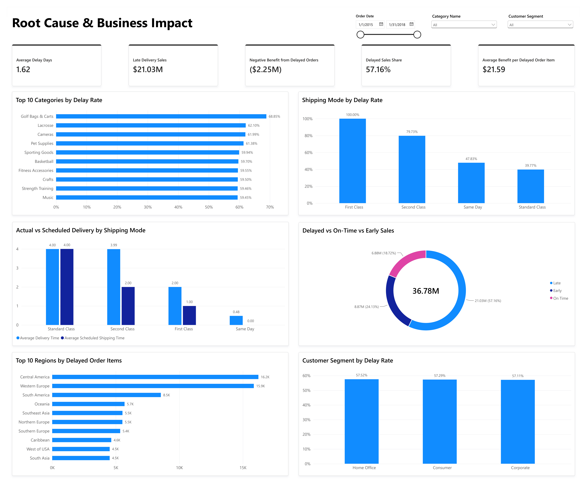

# Supply Chain & Logistics Analytics

An end-to-end data analytics project analyzing supply chain and logistics performance using the DataCo SMART Supply Chain dataset.

The project focuses on delivery performance, shipping modes, regional operations, product categories, customer segments, and the business impact associated with delayed order items.

---

## Project Overview

Delivery performance is an important component of supply chain operations because delays can affect operational efficiency, customer experience, and business performance.

This project analyzes historical supply chain data to identify patterns in delivery delays, evaluate shipping-mode performance, compare regional performance, investigate product-category patterns, and assess the business exposure associated with delayed order items.

The analysis combines **Python, SQL, and Power BI** to build an end-to-end analytical workflow from raw data preparation to business recommendations.

---

## Business Problem

The business needs to understand:

- How well are orders being delivered?
- Which shipping modes show the highest delay rates?
- Which regions contribute the largest volume of delayed order items?
- Which product categories show higher delivery risk?
- Does delivery performance differ meaningfully across customer segments?
- What is the business exposure associated with delayed order items?
- Where should operational improvement efforts be prioritized?

---

## Objectives

The main objectives of this project are to:

1. Analyze overall delivery performance.
2. Evaluate delivery performance across shipping modes.
3. Identify regional delivery patterns and operational hotspots.
4. Investigate category-level delivery performance.
5. Compare delivery performance across customer segments.
6. Measure sales and recorded benefit associated with delayed order items.
7. Develop actionable business recommendations based on the findings.

---

## Dataset

**Dataset:** DataCo SMART Supply Chain Dataset

The dataset contains historical supply chain and logistics information, including:

- Orders and order items
- Customers
- Product categories
- Regions and locations
- Sales
- Shipping modes
- Scheduled and actual shipping duration
- Delivery status
- Delivery delay indicators
- Order profitability / benefit metrics

### Dataset Grain

The dataset is analyzed at the **order-item level**.

This distinction is important because one order can contain multiple order items. Therefore, order-level and order-item-level metrics are calculated separately where appropriate.

### Dataset Size

| Metric             |   Value |
| ------------------ | ------: |
| Rows / Order Items | 180,519 |
| Unique Orders      |  65,752 |
| Columns            |      53 |

---

## Analytical Approach

### 1. Data Understanding & Profiling

The raw dataset was profiled to understand:

- Dataset structure
- Data types
- Missing values
- Duplicate records
- Unique values
- Potential outliers
- Data quality issues
- Business meaning of important variables

The original dataset contained missing values in several fields, including product description and customer/order zipcode fields. Fields with substantial missingness were evaluated based on their analytical usefulness.

---

### 2. Data Cleaning & Preparation

The data preparation process included:

- Handling encoding issues
- Standardizing data types
- Converting date fields
- Validating numerical fields
- Creating delivery-performance indicators
- Creating date-related analytical features
- Preparing a cleaned dataset for SQL and Power BI

The processed dataset is stored in:

`data/processed/cleaned_supply_chain.csv`

---

### 3. PostgreSQL & SQL Analysis

The cleaned dataset was loaded into PostgreSQL using a dedicated `supply_chain` schema and `order_items` table.

SQL analysis was performed using:

- Aggregations
- `GROUP BY`
- `CASE`
- `JOIN`
- CTEs
- Window functions
- Date functions
- Ranking
- Percentage calculations

The analysis focused on:

- Delivery performance
- Shipping-mode performance
- Regional performance
- Category performance
- Customer-segment performance
- Cancellation patterns
- Business impact

---

### 4. Exploratory Data Analysis

Python was used to explore delivery and operational patterns through:

- Trend analysis
- Distribution analysis
- Regional comparisons
- Shipping-mode comparisons
- Category-level analysis
- Customer-segment analysis
- Business-impact analysis

---

### 5. Power BI Dashboard

The final Power BI dashboard contains three analytical pages.

#### Page 1 — Executive Overview

Provides a high-level overview of:

- Total Orders
- Total Sales
- Total Order Items
- Delivered Orders
- Sales per Order
- Orders trend
- Sales trend
- Delivery performance
- Top regions by sales

#### Page 2 — Logistics Performance

Focuses on operational delivery performance:

- Average Delivery Time
- Average Scheduled Shipping Time
- Non-Late Delivery Rate
- Delay Rate
- Delayed Order Items
- Regional delivery performance
- Shipping-mode performance
- Delivery-time trend
- Category delay volume
- Delivery-time distribution

#### Page 3 — Root Cause & Business Impact

Focuses on operational patterns and business exposure:

- Average Delay Days
- Late Delivery Sales
- Negative Benefit from Delayed Orders
- Delayed Sales Share
- Average Benefit per Delayed Order Item
- Category delay rates
- Shipping-mode delay rates
- Actual vs scheduled delivery
- Sales by delivery performance
- Regional delayed volume
- Customer-segment delay rates

---

## Key KPIs

| KPI                                  |    Result |
| ------------------------------------ | --------: |
| Total Orders                         |    65,752 |
| Total Order Items                    |   180,519 |
| Total Sales                          |   $36.78M |
| Delivered Orders                     |    21,716 |
| Sales per Order                      |   $559.45 |
| Average Delivery Time                | 3.50 days |
| Average Scheduled Shipping Time      | 2.93 days |
| Delivery Gap                         | 0.57 days |
| Delay Rate                           |    57.28% |
| Non-Late Delivery Rate               |    42.72% |
| Delayed Order Items                  |   103,400 |
| Delayed Sales                        |   $21.03M |
| Delayed Sales Share                  |    57.16% |
| Negative Benefit from Delayed Orders |   -$2.25M |

> **Note:** Non-Late Delivery Rate includes both early and exact on-time deliveries. It should not be interpreted as the exact on-time delivery rate.

---

## Key Insights

### 1. Delivery delays are a significant operational issue

**57.28% of order items were classified as delayed**, while 42.72% were classified as non-late.

The non-late group consists of approximately:

- 24.02% early deliveries
- 18.70% exact on-time deliveries

---

### 2. Shipping-mode performance varies substantially

First Class recorded a **100% delay rate**, while Second Class recorded a **79.73% delay rate**.

Standard Class performed considerably better with a **39.77% delay rate**.

These results indicate that shipping-mode performance should be investigated further, although the analysis does not establish shipping mode as the cause of delays.

---

### 3. Regional performance should be evaluated using both rate and volume

Central Africa recorded the highest delay rate at **60.70%**, but represented only **556 orders**.

In comparison, Central America and Western Europe contributed approximately **16.2K and 15.9K delayed order items**, respectively.

Therefore, both delay rate and delayed volume should be considered when prioritizing operational improvements.

---

### 4. Delivery performance is similar across customer segments

Delay rates were highly similar across customer segments:

| Customer Segment | Delay Rate |
| ---------------- | ---------: |
| Home Office      |     57.52% |
| Consumer         |     57.29% |
| Corporate        |     57.11% |

The difference between the highest and lowest segment was only **0.41 percentage points**.

This suggests that delivery improvement efforts should focus more heavily on operational dimensions such as shipping mode, region, and category.

---

### 5. Delayed order items represent significant business exposure

Delayed order items were associated with approximately **$21.03M in sales**, representing **57.16% of total sales**.

They were also associated with approximately **-$2.25M in negative recorded benefit**.

These figures represent business exposure associated with delayed order items, not revenue or profit losses proven to be caused by delivery delays.

---

## Business Recommendations

Based on the analysis, the recommended priorities are:

### Priority 1 — Investigate Shipping-Mode Performance

Conduct a deeper review of First Class and Second Class performance, including carrier execution, fulfillment timing, handover processes, and scheduling assumptions.

### Priority 2 — Focus on High-Volume Delayed Regions

Prioritize regions with both high delay rates and large delayed order-item volumes.

### Priority 3 — Investigate High-Impact Product Categories

Identify categories with persistent high delay rates or large delayed volumes and evaluate their performance across regions and shipping modes.

### Priority 4 — Review Delivery Scheduling

Monitor the gap between actual and scheduled delivery times and evaluate whether delivery expectations reflect operational performance.

### Priority 5 — Incorporate Business Impact

Combine operational delivery metrics with sales and recorded benefit indicators to prioritize areas with greater business exposure.

For detailed findings and recommendations, see:

- [`reports/business_insights.md`](reports/business_insights.md)
- [`reports/business_recommendations.md`](reports/business_recommendations.md)

---

## Dashboard Preview

### Executive Overview



### Logistics Performance



### Root Cause & Business Impact



---

## Project Structure

```text
supply-chain-logistics-analytics/
│
├── data/
│   ├── raw/
│   │   └── DataCoSupplyChainDataset.csv
│   └── processed/
│       └── cleaned_supply_chain.csv
│
├── notebooks/
│   ├── 01_data_understanding.ipynb
│   ├── 02_data_cleaning.ipynb
│   └── 03_exploratory_data_analysis.ipynb
│
├── sql/
│   ├── 01_database_setup.sql
│   ├── 02_database_validation.sql
│   └── 03_supply_chain_analysis.sql
│
├── powerbi/
│   └── dashboard.pbix
│
├── images/
│   ├── dashboard_page_1.png
│   ├── dashboard_page_2.png
│   └── dashboard_page_3.png
│
├── reports/
│   ├── business_insights.md
│   └── business_recommendations.md
│
├── .gitignore
├── requirements.txt
└── README.md
```

---

## Tools & Technologies

### Programming & Analysis

- Python
- Pandas
- NumPy
- Matplotlib
- Seaborn
- SciPy

### Database & SQL

- PostgreSQL

### Business Intelligence

- Microsoft Power BI

### Development & Version Control

- Jupyter Notebook
- Git
- GitHub

---

## How to Run

### 1. Clone the repository

```bash
git clone <your-repository-url>
cd supply-chain-logistics-analytics
```

### 2. Create a virtual environment

```bash
python -m venv .venv
```

### 3. Activate the virtual environment

Windows:

```bash
.venv\Scripts\activate
```

### 4. Install dependencies

```bash
pip install -r requirements.txt
```

### 5. Run the notebooks

Open the notebooks in the following order:

```text
01_data_understanding.ipynb
02_data_cleaning.ipynb
03_exploratory_data_analysis.ipynb
```

### 6. PostgreSQL

The SQL scripts in the `sql/` directory contain the database setup, validation, and analytical queries.

The database configuration should be adjusted to the user's local PostgreSQL environment.

### 7. Power BI

Open the Power BI dashboard file located in:

```text
powerbi/dashboard.pbix
```

---

## Limitations

This project is based on historical order-item data and therefore has several limitations.

The dataset does not provide sufficient information to directly analyze:

- Warehouse performance
- Supplier performance
- Carrier-level performance
- Transportation route optimization
- Delivery distance
- Real-time shipment tracking
- Customer satisfaction or ratings

Therefore, the analysis focuses on dimensions supported by the available data.

Additionally, observed relationships between shipping modes, regions, categories, and delivery performance should be interpreted as **associations rather than causal relationships**.

---

## Future Improvements

Future analysis could be enhanced by incorporating additional operational data such as:

- Carrier performance
- Warehouse processing time
- Supplier performance
- Transportation routes
- Delivery distance
- Inventory availability
- Customer satisfaction
- Delivery cost

Additional data would enable deeper root-cause analysis and potentially support predictive delivery-risk modeling.

---

## Author

**Muhamad Rukhul Kirom**

Data Analyst Portfolio Project
